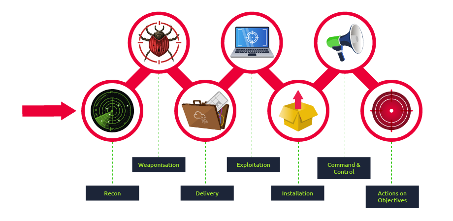
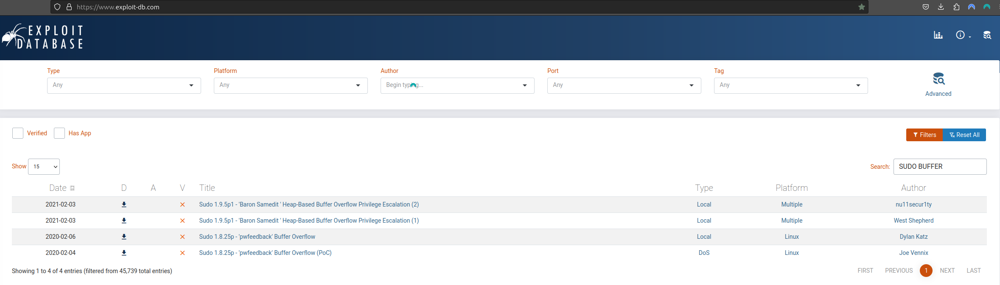
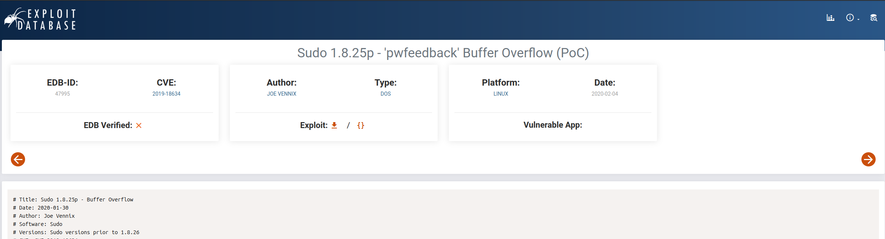

## Engagement Structure 
<p>A core function of the red team is adversary emulation. While not mandatory, it is commonly used to assess what a real adversary would do in an environment using their tools and methodologies. The red team can use various cyber kill chains to summarize and assess the steps and procedures of an engagement.

The blue team commonly uses cyber kill chains to map behaviors and break down an adversaries movement. The red team can adapt this idea to map adversary TTPs (Tactics, Techniques, and Procedures) to components of an engagement.

Many regulation and standardization bodies have released their cyber kill chain. Each kill chain follows roughly the same structure, with some going more in-depth or defining objectives differently. Below is a small list of standard cyber kill chains.</p>


  * [Lockheed Martin Cyber Kill Chain](https://www.lockheedmartin.com/en-us/capabilities/cyber/cyber-kill-chain.html)
  * [Unified Kill Chain](https://www.lockheedmartin.com/en-us/capabilities/cyber/cyber-kill-chain.html)
*  [Varonis Cyber Kill Chain](https://www.varonis.com/blog/cyber-kill-chain/)
* [Active Directory Attack Cycle](https://www.varonis.com/blog/cyber-kill-chain/)
* [MITRE ATT&CK Framework](https://attack.mitre.org/) 

<h3>Components of the kill chain are broken down in the table below.</h3>
<table class="table table-bordered">
<thead>
<tr>
<th>Technique</th>
<th>Purpose</th>
<th>Examples</th>
</tr>
</thead>
<tbody>
<tr>
<td style="text-align:left">Reconnaissance</td>
<td style="text-align:left">Obtain information on the target</td>
<td style="text-align:left"><span>Harvesting emails, <a class="Gx6hZL4g glossary-term" onclick="initPopOver('OSINT', 'Gx6hZL4g')">OSINT</a></span></td>
</tr>
<tr>
<td style="text-align:left">Weaponization</td>
<td style="text-align:left">Combine the objective with an exploit. Commonly results in a deliverable payload.</td>
<td style="text-align:left">Exploit with backdoor, malicious office document</td>
</tr>
<tr>
<td style="text-align:left">Delivery</td>
<td style="text-align:left">How will the weaponized function be delivered to the target</td>
<td style="text-align:left">Email, web, USB</td>
</tr>
<tr>
<td style="text-align:left">Exploitation</td>
<td style="text-align:left">Exploit the target's system to execute code</td>
<td style="text-align:left">MS17-010, Zero-Logon, etc.</td>
</tr>
<tr>
<td style="text-align:left">Installation</td>
<td style="text-align:left">Install malware or other tooling</td>
<td style="text-align:left">Mimikatz, Rubeus, etc.</td>
</tr>
<tr>
<td style="text-align:left">Command &amp; Control</td>
<td style="text-align:left">Control the compromised asset from a remote central controller</td>
<td style="text-align:left">Empire, Cobalt Strike, etc.</td>
</tr>
<tr>
<td style="text-align:left">Actions on Objectives</td>
<td style="text-align:left">Any end objectives: ransomware, data exfiltration, etc.</td>
<td style="text-align:left">Conti, LockBit2.0, etc.</td>
</tr>
</tbody>
</table>
<h1 align="center">


  <br>
<hr>  
<br>
  Red Team Operation Tools
  <br>


  
</h1>

<h4 align="center">A package tools for red team operations.</h4>


<p align="center">
  <a href="#guides">Guides</a> •
  <a href="#osint">OSINT</a> •
  <a href="#vulnerability-searching">Vulnerability Searching</a> •
  <a href="#recon">RECON</a> •
  <a href="#frameworks">Frameworks</a> •
  <a href="#command-injection">Command Injection</a> •
  <a href="#subdomains">Subdomains</a> •
  <a href="#webspidering">Web Spidering</a> •
  <a href="#directory-fuzzing">Directory Fuzzing</a> •
  <a href="#fingerprint">Finger print</a> •
  <a href="#vulnerability">Vulnerability</a> •
  <a href="#sensitive-data">Sensitive data</a> •
  <a href="#payloads-e-wordlists">Payloads e wordlist</a> •
  <a href="#ssl">SSL</a> •
  <a href="#misc">Misc</a> •
  <a href="#xss">XSS</a> •
  <a href="#lfi-e-rfi">LFI/RFI</a> •
  <a href="#dos">DOS</a> •
  <a href="#cloud">Cloud</a> •
  <a href="#pishing">Pishing</a> •
  <a href="#sql-injection">SQL Injection</a> •
  <a href="#communication">Communication</a> 
</p>

## Guides

* [Red Team Guide](https://redteam.guide/docs/templates/roe_template/)
* [Red Team Tools](https://github.com/A-poc/RedTeam-Tools)
* [Blue Team Tools](https://github.com/A-poc/BlueTeam-Tools)
* [Hack tools Chrome](https://github.com/LasCC/Hack-Tools)

## Vulnerability Searching
* [ExploitDB](https://www.exploit-db.com/)
* [NVD](https://nvd.nist.gov/vuln/search)
* [CVE Mitre](https://cve.mitre.org/)

Example search exploit from exploitdb on Kali using <b>searchsploit</b>

In this scenario i want a exploit 2020 buffer overflow in the sudo program

```bash
searchsploit "buffer overflow sudo 2020"
```
this return a list of exploits encounterd in ExploitDB with these words

if you look in exploitdb you will also find

In it you have important information, such as the <b>CVE</b>, which is the year and number of the vulnerability 

In this exploit example CVE is: CVE-2019-18634

You can see more details on:
https://nvd.nist.gov/vuln/detail/CVE-2019-18634


## RECON
* [KingOfBugBountyTips](https://github.com/KingOfBugbounty/KingOfBugBountyTips)


## OSINT

* [OSINT Framework](https://osintframework.com/)
* [Ifind](ifind.com/)
* [Google Hacking Database](https://www.exploit-db.com/google-hacking-database)
* [Shodan](https://www.shodan.io/dashboard?language=en)
* [WayBackMachine](https://web.archive.org/)
* [Perito Cibernetico](https://peritocibernetico.com.br/)
* [Yandex](https://yandex.com/)
* [Gmail OSINT](https://gmail-osint.activetk.jp/)
* [trape](https://github.com/jofpin/trape)

## Frameworks

* [Jok3r](https://github.com/koutto/jok3r)
  - Directory report:  /var/lib/docker/overlay2/7564110b79006ce12e17a7036ed8cf837cbace06b8b02c6fa450c273bf25bbe7/diff/root/jok3r/reports
* [Sn1per](https://github.com/1N3/Sn1per)
  - Directory report:/usr/share/sniper/loot/workspace/https:--loja.obahortifruti.com.br/osint/intodns-loja.obahortifruti.com.br.html
* [Mythic](https://github.com/its-a-feature/Mythic.git) 


## COMMAND INJECTION

* [Commix](https://github.com/commixproject/commix.git)

## SUBDOMAINS

* [knock](https://github.com/guelfoweb/knock)
* [lazyrecon](https://github.com/nahamsec/lazyrecon)
* [subfinder](https://github.com/projectdiscovery/subfinder)
* [assetfinder](https://github.com/tomnomnom/assetfinder)
* [Amass](https://github.com/OWASP/Amass)
* [subliest3r](https://github.com/aboul3la/Sublist3r)

## WEBSPIDERING

* [gospider](https://github.com/jaeles-project/gospider)
* [gau](https://github.com/lc/gau)
* [LinkFinder](https://github.com/GerbenJavado/LinkFinder)
* [waybackurls](https://github.com/tomnomnom/waybackurls)
* [hakrawler](https://github.com/hakluke/hakrawler)
* [ParamSpider](https://github.com/devanshbatham/ParamSpider)

## Directory Fuzzing

* [ffuf](https://github.com/ffuf/ffuf)
* [wfuzz](https://github.com/xmendez/wfuzz)
* [gobuster](https://github.com/OJ/gobuster)
* [DirBuster](https://github.com/KajanM/DirBuster)
* [dirb](https://github.com/v0re/dirb)
* [turbo search](https://github.com/helviojunior/turbosearch)

## FINGERPRINT
* [wappalyzer](https://chrome.google.com/webstore/detail/wappalyzer-technology-pro/gppongmhjkpfnbhagpmjfkannfbllamg?hl=pt-BR)
* [builtwith](https://chrome.google.com/webstore/detail/builtwith-technology-prof/dapjbgnjinbpoindlpdmhochffioedbn?hl=pt)
* [whatweb](https://github.com/urbanadventurer/WhatWeb)

## VULNERABILITY

* [nuclei](https://github.com/projectdiscovery/nuclei)
* [wpscan](https://github.com/wpscanteam/wpscan)
* [nikto](https://github.com/sullo/nikto)
* [owaspzap](https://www.zaproxy.org/)

## SENSITIVE DATA

* [intelx](https://intelx.io/)
* [leakcheck](https://leakcheck.net/)
* [snusbase](https://snusbase.com/)
* [breachchecker](https://breachchecker.com/)
* [leak lookup](https://leak-lookup.com/)
* [we leak info](https://weleakinfo.to/)
* [leak check](https://leakcheck.io/)
* [scatteredsecrets](https://lnkd.in/d5X_jCp8)
* [ghostproject](https://ghostproject.fr/)


## PAYLOADS E WORDLISTS
* [PayloadsAllTheThings](https://github.com/swisskyrepo/PayloadsAllTheThings)
* [seclists wordlists](https://github.com/danielmiessler/SecLists)
* [leaky-paths](https://github.com/ayoubfathi/leaky-paths)
 
## SSL
* [sslscan](https://github.com/rbsec/sslscan)
* [sslhopper](https://www.sslshopper.com/)
 
## MISC
* [httpx](https://github.com/projectdiscovery/httpx)
* [metasploit](https://github.com/rapid7/metasploit-framework)
* [dnsdumpster](https://github.com/nmmapper/dnsdumpster)
* [httprobe](https://github.com/tomnomnom/httprobe)
* [recon-ng](https://github.com/lanmaster53/recon-ng)
* [securitytrails](https://github.com/secops4thewin/securitytrails-python/blob/master/securitytrails.py)
 
## XSS
* [xss-Strike](https://github.com/s0md3v/XSStrike )
* [ppmap](https://github.com/kleiton0x00/ppmap.git)

## LFI E RFI
* [kadimus](https://github.com/P0cL4bs/kadimus)
  - requiriment: apt install libcurl4-nss-dev libpcre3-dev libssh-dev
./kadimus -u https://www.cocamar.com.br/busca?s= -T data --parameter -c "id"

## DOS
* [slowhttptest](https://github.com/shekyan/slowhttptest.git)
  - slowhttptest -c 500 -H -g -o ./result -i 10 -r 200 -t GET -u https://sunweb.cocamar.com.br/ -x 24 -p 2
 
## CLOUD
* [Cloud Brute](https://github.com/0xsha/CloudBrute)
* [Awesome Azure Pentest](https://github.com/Kyuu-Ji/Awesome-Azure-Pentest)

## PISHING

* [gophish](https://github.com/gophish/gophish)
* [zphisher](https://github.com/htr-tech/zphisher)
* [SocialFish](https://github.com/UndeadSec/SocialFish)

## SQL INJECTION

* [sqlmap](https://github.com/sqlmapproject/sqlmap)

## COMUNICATTION
* [vectro.io](http://vectr.io/)
* [slack](https://slack.com/intl/pt-br/)


## References

https://tryhackme.com/