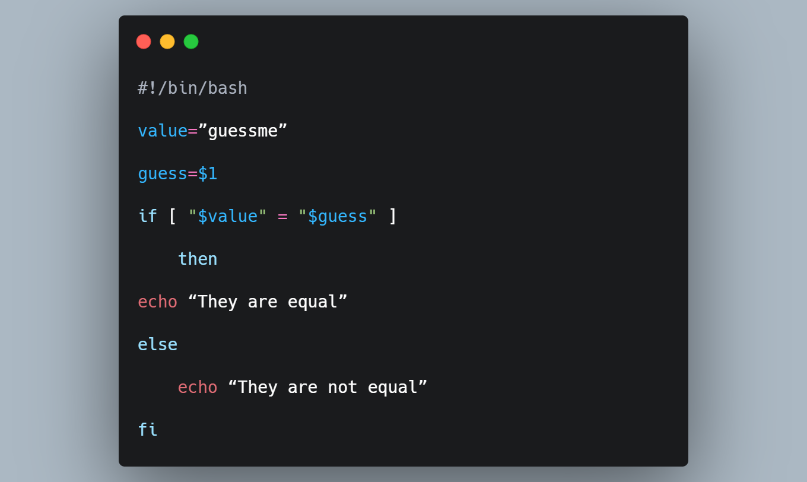

<h1 align="center">
Bash scripting


</h1>
<br>

# What is bash?

Bash is a scripting language that runs within the terminal on most Linux distros, as well as MacOS. Shell scripts are a sequence of bash commands within a file, combined together to achieve more complex tasks than simple one-liner and are especially useful when it comes to automating sysadmin tasks such as backups.

This is a few things among many that you will learn in this room:

- Bash syntax
- Variables
- Using parameters
- Arrays
- conditionals

Throughout this room feel free to work along with me! You can test out the commands shown or integrate them into your own projects, after all you learn by practicing and applying what you have learnt into your own scenarios. Make sure to spawn the tryhackme attackbox or use your own terminal.

I found this website very useful when I was on my journey of learning bash, feel free to use it to help you through this room and for further learning after you finish! https://devhints.io/bash 


# First simple bash scripts 

Use any editor of your preference, vi, vim, nano, etc.

And remember to save it with filename`.sh`

First of all let’s lay out our structure.

A bash script always starts with the following line of code at the top of the script.

`#!/bin/bash`

This is so your shell (whatever type of it) knows that it needs to run your file using bash in the terminal.

Lets get into some basic examples.

You can also perform normal Linux commands inside your bash script and it will be executed if formatted right. For example we can run the command ` “ls”`, `"id"`, `"whoami"` inside our bash script and we will see the output when we run the file. So lets make it do this!

```bash
#!/bin/bash

echo "Hello world"

whoami

id

ls

```
This will return the string <b>“Hello World”</b>, whoami, id and ls command. The command <b>“echo”</b> is used to output text to the screen, the same way as “print” in python. I suggest you test this out in your terminal to get to grips with bash!

Now to run our bash script we must first give it executable permissions

`chmod +x yourfile.sh`

And then we run it using `./yourfile.sh`

We can see it has outputted the results of the commands "echo", “whoami”, “id” and "ls".

#  Variables 
Now we are moving onto variables, in bash these are quite simple and we create them like so:


Where we give the value of `Jammy` and assign it to the variable `name`.

Please note that for variables to work you cannot leave a space between the variable name, the ”=” and the value. They cannot have spaces in.

So how would we now use our variable? Well its also very simple.


We have to add a `$` onto front of our variable name in order to use it.


If we test this out in our own terminal we get something like this:

`name="Jammy"`

`echo $name`

`Jammy`

This would output “Jammy” to the screen.

Variables make it much easier to store data and rather than typing out the same thing in multiple places we could simply insert our variable with $var and then declare that to a certain value making it easier to fall back on if you do something wrong and need to change it. So how can we debug our code?


Debugging is a very important part of programming so we should get used to problem solving and fixing errors as early as possible. And bash has a few built in features that make our life simple.

When running at the command line you can do:

`bash -x ./file.sh`

You can make a simple bash script(now you know some basic syntax) and make something completely wrong. Then step through your program with debug mode and see what it looks like when it throws errors!


This tells you which lines are working and which lines are not. If you want to debug at a certain point you can insert `set -x` into your script and `set +x` to end the section like the following:


So lets look at an example. This is our script from earlier being ran with `bash -x ./example.sh`


You can see its outputting a + for the command and then the output of what that command executed. If there was an error it would output a - on that line this makes it easy to spot where you have gone wrong so you can fix them.


We can also use multiple variables in something like an echo statement. You aren't just limited to using 1!


# Parameters

We will now look at one of the main features of bash and that's using parameters.


We will firstly  look at parameters specified using the command line when running the file. These come in many forms but often have the "$" prefix because a parameter is still a variable.

Lets start by declaring a parameter that is going to be our first argument when running our bash script.


We now run our script with `./example.sh Spindart`

And sure enough we get returned with “Spindart”

So what if we wanted the 2nd argument? Well the process is very simple and we simply add a `$2` instead of `name=$1`

Then run with `./example.sh Spin Dart`

What do you think it would return?

And it would return <b>"Dart"</b>.

What if we didn't want to supply them like this however, and instead it would let us type in our name in a more interactive way, we can do this using `read`.


This code will hang after its ran, this gives you the opportunity to type in your name.

And we can see that it worked!


Maybe try making a little biography maker, where you take the name, age, and job as parameters. Store them inside a variable and then output them to the screen inside a sentence. 


However there is so much more that you can do with parameters and I advice you to play around with them, after all practice is what makes you better! 

 The `$#` symbol you used is often used in bash scripts to represent the number of command-line arguments passed to the script. Here's a simple example of a bash script that uses $# to display the number of arguments:


<b>Check the number of arguments</b>

(you'll see conditionals soon <a href="#conditionals">here</a> )

```bash
if [ $# -eq 0 ]; then
    echo "No arguments provided."
elif [ $# -eq 1 ]; then
    echo "One argument provided."
else
    echo "Multiple arguments provided."
fi
``` 

with `$0` we can get the name of the file bash.

example `echo $0` print the filename.

# Arrays

For this module i suggest you follow along in the attackbox or a standard linux terminal to make it easier to understand.

Arrays are used to store multiple pieces of data in one variable, which can then be extracted by using an index. Most commonly notated as `var[index_position]`.

Arrays use indexing meaning that each item in an array stands for a number.

In the array `['car', 'train', 'bike', 'bus']` each item has a corresponding index.

All indexes start at <b>position 0</b>

<table><tbody><tr><td>item</td><td>index</td></tr><tr><td>car</td><td>0</td></tr><tr><td>train</td><td>1</td></tr><tr><td>bike</td><td>2</td></tr><tr><td>bus</td><td>3</td></tr></tbody></table>

Now we have covered this, let's make an array in bash.

The syntax is as follows.

We have the variable name, in our case ‘transport’

We then wrap each item in brackets leaving a space between each item.
```bash
transport=('car' 'train' 'bike' 'bus')
```
We can then echo out all the elements in our array like this:
```bash
echo "${transport[@]}"
```
You can try this in your own terminal and see what it outputs.

Where the "@" means all arguments, and the [] wrapped around it specifies its index.

So what if we wanted to print out the item train.

We would simply type:
```bash
echo "${transport[1]}"
```
because the train is at index position 1.


The last thing we will cover is if we want to change an element, or delete it. If we wanted to remove an variable we would use the <b>unset</b> utility.
```bash
unset transport
```

Unset an specifc element in an array

```bash
#!/bin/bash

# Declare an array
transports=('car' 'train' 'bike' 'bus')

# Print the original array
echo "Original array: ${transports[@]}"

# Specify the index of the element you want to remove
index_to_remove=1

# Create a new array without the element at the specified index
new_transports=("${transports[@]:0:index_to_remove}" "${transports[@]:index_to_remove+1}")

# Print the new array
echo "Array with element at index $index_to_remove removed: ${new_transports[@]}"
```

In this script:

- We declare an array named transports.
- We specify the index (index_to_remove) of the element we want to remove, which is 1 (the second element, 'train' in this case).
- We create a new array named new_transports by concatenating two slices of the original transports array. The first slice includes elements from the beginning up to the index to remove, and the second slice includes elements from the index after the one we want to remove to the end.
- Finally, we print the new array without the specified element.

This way, you effectively remove the desired element from the array.


So we successfully managed to swap out an element in our array!

As a little side project try building on your previous project of a biography maker, include arrays so that you can store multiple names and multiple facts about the person. 

# Conditionals 


When we talk about conditionals it means that a certain piece of code relies on a condition being met, this is often determined with relational operators, such as equal to, greater than, and less than.

We will make a simple "if" statement to check if a variable is equal to a value, we will also make a script that checks if a file exists and that it is writeable, if it is we will write a message to that file, if not writeable it will delete it and make a new one. A Lot of new things will be taught here so pay attention.


First, we will discuss the basic syntax of an if statement.

All if statements look like so:


Let's look at an example:


If statements always use a pair of brackets and in the case of the [] we need to leave a space on both sides of the text(the bash syntax). We also always need to end the `if` statement with `fi`

Here a variable is being declared as 10 and in the top line of the if statement the variable $count is being compared to the integer 10.

If they are equal then it outputs true, if its false it outputs false. As we know 10 is equal to 10 so it outputs true.

The -eq is one way of doing this, you could also use <b>“=”</b>

<table><tbody><tr><td style="border-left:solid #dddddd 0.75pt;border-right:solid #dddddd 0.75pt;border-bottom:solid #dddddd 0.75pt;border-top:solid #dddddd 0.75pt;vertical-align:top;background-color:#eeeeee;padding:6pt 6pt 6pt 6pt;overflow:hidden;overflow-wrap:break-word"><p style="line-height:1.714284;text-align:center;margin-top:0pt;margin-bottom:15pt"><span style="font-size:12pt;font-family:Arial;color:#000000;background-color:transparent;font-weight:700;font-style:normal;font-variant:normal;text-decoration:none;vertical-align:baseline;white-space:pre;white-space:pre-wrap">Operator</span></p></td><td style="border-left:solid #dddddd 0.75pt;border-right:solid #dddddd 0.75pt;border-bottom:solid #dddddd 0.75pt;border-top:solid #dddddd 0.75pt;vertical-align:top;background-color:#eeeeee;padding:6pt 6pt 6pt 6pt;overflow:hidden;overflow-wrap:break-word"><p style="line-height:1.714284;text-align:center;margin-top:0pt;margin-bottom:15pt"><span style="font-size:12pt;font-family:Arial;color:#000000;background-color:transparent;font-weight:700;font-style:normal;font-variant:normal;text-decoration:none;vertical-align:baseline;white-space:pre;white-space:pre-wrap">Description</span></p></td></tr><tr><td style="border-left:solid #dddddd 0.75pt;border-right:solid #dddddd 0.75pt;border-bottom:solid #dddddd 0.75pt;border-top:solid #dddddd 0.75pt;vertical-align:top;padding:6pt 6pt 6pt 6pt;overflow:hidden;overflow-wrap:break-word"><p style="line-height:1.714284;margin-top:0pt;margin-bottom:15pt"><span >-eq</span></p></td><td style="border-left:solid #dddddd 0.75pt;border-right:solid #dddddd 0.75pt;border-bottom:solid #dddddd 0.75pt;border-top:solid #dddddd 0.75pt;vertical-align:top;padding:6pt 6pt 6pt 6pt;overflow:hidden;overflow-wrap:break-word"><p style="line-height:1.714284;margin-top:0pt;margin-bottom:15pt"><span > <b>==</b> Checks if the value of two operands are equal or not; if yes, then the condition becomes true.</span></p></td></tr><tr><td style="border-left:solid #dddddd 0.75pt;border-right:solid #dddddd 0.75pt;border-bottom:solid #dddddd 0.75pt;border-top:solid #dddddd 0.75pt;vertical-align:top;padding:6pt 6pt 6pt 6pt;overflow:hidden;overflow-wrap:break-word"><p style="line-height:1.714284;margin-top:0pt;margin-bottom:15pt"><span >-ne</span></p></td><td style="border-left:solid #dddddd 0.75pt;border-right:solid #dddddd 0.75pt;border-bottom:solid #dddddd 0.75pt;border-top:solid #dddddd 0.75pt;vertical-align:top;padding:6pt 6pt 6pt 6pt;overflow:hidden;overflow-wrap:break-word"><p style="line-height:1.714284;margin-top:0pt;margin-bottom:15pt"><span > <b>!=</b> Checks if the value of two operands are equal or not; if values are not equal, then the condition becomes true.</span></p></td></tr><tr><td style="border-left:solid #dddddd 0.75pt;border-right:solid #dddddd 0.75pt;border-bottom:solid #dddddd 0.75pt;border-top:solid #dddddd 0.75pt;vertical-align:top;padding:6pt 6pt 6pt 6pt;overflow:hidden;overflow-wrap:break-word"><p style="line-height:1.714284;margin-top:0pt;margin-bottom:15pt"><span >-gt</span></p></td><td style="border-left:solid #dddddd 0.75pt;border-right:solid #dddddd 0.75pt;border-bottom:solid #dddddd 0.75pt;border-top:solid #dddddd 0.75pt;vertical-align:top;padding:6pt 6pt 6pt 6pt;overflow:hidden;overflow-wrap:break-word"><p style="line-height:1.714284;margin-top:0pt;margin-bottom:15pt"><span ><b>></b> Checks if the value of left operand is greater than the value of right operand; if yes, then the condition becomes true.</span></p></td></tr><tr><td style="border-left:solid #dddddd 0.75pt;border-right:solid #dddddd 0.75pt;border-bottom:solid #dddddd 0.75pt;border-top:solid #dddddd 0.75pt;vertical-align:top;padding:6pt 6pt 6pt 6pt;overflow:hidden;overflow-wrap:break-word"><p style="line-height:1.714284;margin-top:0pt;margin-bottom:15pt"><span >-lt</span></p></td><td style="border-left:solid #dddddd 0.75pt;border-right:solid #dddddd 0.75pt;border-bottom:solid #dddddd 0.75pt;border-top:solid #dddddd 0.75pt;vertical-align:top;padding:6pt 6pt 6pt 6pt;overflow:hidden;overflow-wrap:break-word"><p style="line-height:1.714284;margin-top:0pt;margin-bottom:15pt"><span> <b><</b> Checks if the value of left operand is less than the value of right operand; if yes, then the condition becomes true.</span></p></td></tr><tr><td style="border-left:solid #dddddd 0.75pt;border-right:solid #dddddd 0.75pt;border-bottom:solid #dddddd 0.75pt;border-top:solid #dddddd 0.75pt;vertical-align:top;padding:6pt 6pt 6pt 6pt;overflow:hidden;overflow-wrap:break-word"><p style="line-height:1.714284;margin-top:0pt;margin-bottom:15pt"><span >-ge</span></p></td><td style="border-left:solid #dddddd 0.75pt;border-right:solid #dddddd 0.75pt;border-bottom:solid #dddddd 0.75pt;border-top:solid #dddddd 0.75pt;vertical-align:top;padding:6pt 6pt 6pt 6pt;overflow:hidden;overflow-wrap:break-word"><p style="line-height:1.714284;margin-top:0pt;margin-bottom:15pt"><span> <b>>=</b> Checks if the value of left operand is greater than or equal to the value of right operand; if yes, then the condition becomes true.</span></p></td></tr>
<tr><td style="border-left:solid #dddddd 0.75pt;border-right:solid #dddddd 0.75pt;border-bottom:solid #dddddd 0.75pt;border-top:solid #dddddd 0.75pt;vertical-align:top;padding:6pt 6pt 6pt 6pt;overflow:hidden;overflow-wrap:break-word"><p style="line-height:1.714284;margin-top:0pt;margin-bottom:15pt"><span >-le</span></p></td><td style="border-left:solid #dddddd 0.75pt;border-right:solid #dddddd 0.75pt;border-bottom:solid #dddddd 0.75pt;border-top:solid #dddddd 0.75pt;vertical-align:top;padding:6pt 6pt 6pt 6pt;overflow:hidden;overflow-wrap:break-word"><p style="line-height:1.714284;margin-top:0pt;margin-bottom:15pt"><span> <b><=</b> Checks if the value of left operand is less than or equal to the value of right operand; if yes, then the condition becomes true.</span></p></td></tr></tbody></table>

^^^^^ These are some examples.

So now let's use this to make a little script that compares an input(a parameter) and checks it against a value to check if it's true or not. A guessing game if you will.



Now let's test this in our terminal.

`./example.sh guessme`

`"They are equal"`

`./example.sh hi`

`"They are not equal"`

And we can see that it works!

Feel free to play around with these and try making different combinations and using different operators.


Now let's create another script where we will use 2 conditions simultaneously and coming back to a concept we learnt in the first lesson.

Let's begin.

We want to make a script that we will perform on a file given by a parameter.

We then check if it exists and if it has write permissions. If it has write perms then we echo “hello” to it. If it is either non-accessible or doesn't exist we will create the file and echo “hello” to it. Let's begin!


```bash
./example.sh hello.txt
cat hello.txt
```

<B>hello</B>

And we can see that it worked!!

The `-f` checked if the file existed.

The `-w` checked if the file was writable, without write permissions we wouldn't be able to output our text into the file.

To finish off our little project from the previous task. You can build on your script using an if/else statement. Test to see if the age is under 18, if it is then echo out their name with "You are not eligible for work" or something along these lines, if they are over 18 then ask them for their job, you can do this with `read`.

If you want to further extend your knowledge of bash or coding in general I really suggest the following websites:

https://www.codewars.com/
https://www.hackerrank.com/

And of course google!
