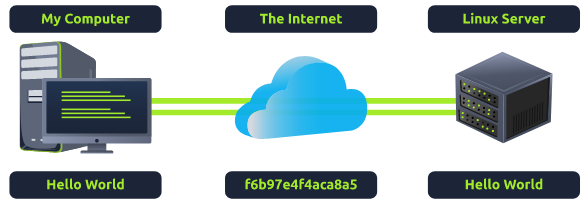
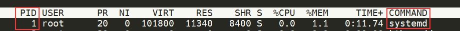
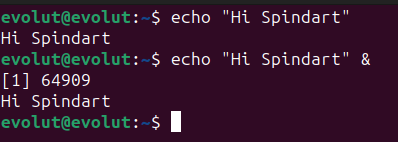
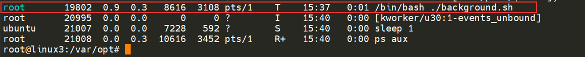
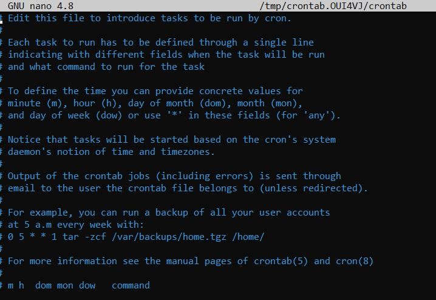
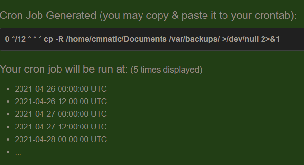

<h1 align="center">
<br>
  Linux Essentials
  <br>

</h1>

The most important command in Linux terminal is <strong><a href="#man">man(ual)</a></strong>, record this! 
through this command you get the manual to understand commands and how to use them


# Interacting With the Filesystem

Basic commands to interact with the filesystem

<table>
<tbody>
<tr>
<td>Command</td>
<td>Full Name</td>
<td>Purpose</td>
</tr>
<tr><td>ls</td><td>listing</td><td>List files/directories.</td></tr>
<tr><td>cd</td><td>change directory</td><td>Change current directory.</td></tr>
<tr><td>cat</td><td>concatenate</td><td>Display file contents.</td></tr>
<tr><td>pwd</td><td>print working directory</td><td>Display Current Directory</td></tr>
<tr><td>touch</td><td>touch</td><td>Create file</td></tr>
<tr><td>mkdir</td><td>make directory</td><td>Create a folder</td></tr>
<tr><td>cp</td><td>copy</td><td>Copy a file or folder</td></tr>
<tr><td>mv</td><td>move</td><td>Move a file or folder</td></tr>
<tr><td>rm</td><td>remove</td><td>Remove a file or folder</td></tr>
<tr><td>file</td><td>file</td><td>Determine the type of a file</td></tr>
</tbody>
</table>

# An Introduction to Shell Operators

<table><tbody><tr><td>Symbol / Operator</td><td>Description</td></tr><tr><td>&amp;</td><td>This operator allows you to run commands in the background of your terminal.</td></tr><tr><td>&amp;&amp;</td><td>This operator allows you to combine multiple commands together in one line of your terminal.</td></tr><tr><td>&gt;</td><td>This operator is a redirector - meaning that we can take the output from a command (such as using cat to output a file) and direct it elsewhere.</td></tr><tr><td>&gt;&gt;</td><td><p>This operator does the same function of the <code>&gt;</code> operator but appends the output rather than replacing (meaning nothing is overwritten).</p></td></tr></tbody></table>

### Operator "&"
This operator allows us to execute commands in the background. For example, let's say we want to copy a large file. This will obviously take quite a long time and will leave us unable to do anything else until the file successfully copies.

The "&" shell operator allows us to execute a command and have it run in the background (such as this file copy) allowing us to do other things!

```bash
sleep 10 & sudo apt update
```

### Operator "&&"
This shell operator is a bit misleading in the sense of how familiar is to its partner "&". Unlike the "&" operator, we can use "&&" to make a list of commands to run for example command1 && command2. However, it's worth noting that command2 will only run if command1 was successful.

<b>Example</b>

```bash
mkdir my_directory && cd my_directory
```

### Operator ">"
This operator is what's known as an output redirector. What this essentially means is that we take the output from a command we run and send that output to somewhere else.

<b>Example</b>

```bash
echo hey > welcome.txt
```

### Operator ">>"
This operator is also an output redirector like in the previous operator (>) we discussed. However, what makes this operator different is that rather than overwriting any contents within a file, for example, it instead just puts the output at the end.

Following on with our previous example where we have the file "welcome" that has the contents of "hey". If were to use echo to add "hello" to the file using the > operator, the file will now only have "hello" and not "hey".

The >> operator allows to append the output to the bottom of the file

```bash
echo hello >> welcome.txt
```

```bash
echo cat welcome.txt
```

OUTPUT:

hey<br>
hello

# SSH

<b>What is SSH & how Does it Work?</b>

<p><b>Secure Shell</b> or <b>SSH</b> simply is a protocol between devices in an encrypted form. Using cryptography, any input we send in a human-readable format is encrypted for travelling over a network -- where it is then unencrypted once it reaches the remote machine, such as in the diagram below.</p>



<p>SSH allows us to remotely execute commands on another device remotely.</p>
<p>Any data sent between the devices is encrypted when it is sent over a network such as the Internet</p>

<b>Construct command to log in to the remote machine using ssh</b>

<b>ssh</b> and then the <b>username</b> of the account, <b>@</b>the IP address of the machine

<b>For example:</b>
```
ssh linuxuser@10.10.224.148
```
That is:

ssh username_account@MACHINE_IP

# Permissions 101


Using ls -lh to list the permissions of all files in the directory

<b>exampĺe ls -l to show permissions of file, user and group</b>

```bash
ls -lh

output:

-rw-r--r-- 1 cmnatic cmnatic 0 Feb 19 10:37 file1
-rw-r--r-- 8 cmnatic cmnatic 0 Feb 19 10:37 file2
```

 <b>Using su to switch to another user interactively </b>
```bash
su -l user2
```
Where now, after using <b>-l</b>, our new session has dropped us into the home directory of "user" automatically. 

in this case: /home/user2


# Common Directories 

<b>/etc</b>

This root directory is one of the most important root directories on your system. The etc folder (short for etcetera) is a commonplace location to store system files that are used by your operating system. 

For example, the sudoers file highlighted in the screenshot below contains a list of the users & groups that have permission to run sudo or a set of commands as the root user.

Also highlighted below are the "passwd" and "shadow" files. These two files are special for Linux as they show how your system stores the passwords for each user in encrypted formatting called sha512.


<b>Some notable contents of the /etc directory</b>

```bash
root@linux2:/etc$ ls
shadow passwd sudoers sudoers.d
```

<b>/var</b>

The "/var" directory, with "var" being short for variable data,  is one of the main root folders found on a Linux install. This folder stores data that is frequently accessed or written by services or applications running on the system. For example, log files from running services and applications are written here (/var/log), or other data that is not necessarily associated with a specific user (i.e., databases and the like).


<b>Some notable contents of the /var directory</b>


```bash
root@linux2:/var$ ls
backups log opt tmp
```
<b>
/root</b>

Unlike the /home directory, the /root folder is actually the home for the "root" system user. There isn't anything more to this folder other than just understanding that this is the home directory for the "root" user. But, it is worth a mention as the logical presumption is that this user would have their data in a directory such as "/home/root" by default.  

<b> Some notable contents of the /root directory </b>

```bash
root@linux2:~# ls
myfile myfolder passwords.xlsx
```
        

<b>/tmp</b>
This is a unique root directory found on a Linux install. Short for <b>"temporary"</b>, the /tmp directory is volatile and is used to store data that is only needed to be accessed once or twice. Similar to the memory on your computer, once the computer is restarted, the contents of this folder are cleared out.

<b>What's useful for us in pentesting is that any user can write to this folder by default. Meaning once we have access to a machine, it serves as a good place to store things like our enumeration scripts.</b>


 <b>Some notable contents of the /tmp directory </b>

```bash
root@linux2:/tmp# ls
todelete trash.txt rubbish.bin
```

# Terminal text editors

`nano` filename

Remmber: `^` = `Ctrl`

Example: `^O` = `Ctrl + O`

You can navigate each line using "Up" and "Down" arrow keys to start a new line using the "Enter"

<b>Commands nano</b>

<b>^G Get Help    ^O Write Out   ^W Where Is    ^K Cut Text    ^J Justify     ^C Cur Pos     M-U Undo       M-A Mark Text
^X Exit        ^R Read File   ^\ Replace     ^U Paste Text  ^T To Spell    ^_ Go To Line  M-E Redo       M-6 Copy Text</b>
<hr>

`vi` filename

Basic commands cheat-sheet on https://www.thegeekdiary.com/basic-vi-commands-cheat-sheet/

<HR>

`vim` filename

VIM is a much more advanced text editor. Whilst you're not expected to know all advanced features, it's helpful to mention it for powering up your Linux skills.

To go to insertion mode (write on a file) key press `i` 

to leave insertion mode press KEY `ESC`

`:q`  quit

`:wq` write and quit

`q!` quit without saving

`:help` help command to usage vim

Some of VIM's benefits, albeit taking a much longer time to become familiar with, includes:
<ul>
<li>Customisable - you can modify the keyboard shortcuts to be of your choosing</li>
<li>Syntax Highlighting - this is useful if you are writing or maintaining code, making it a popular choice for software developers</li>
<li>VIM works on all terminals where nano may not be installed</li>
<li>There are a lot of resources such as <a href="https://vim.rtorr.com/">cheatsheets</a>, tutorials, and the sorts available to you use.</li>
</ul>


<hr>


# General/Useful Utilities 

<h3>curl</h3>

Downloading a File:

`curl -O https://example.com/file.zip`

Downloading a File with a Different Name:

`curl -o newfilename.zip https://example.com/file.zip`

Http <b>GET</b> request

`curl https://api.example.com/data`

Http <b>POST</b> Request

`curl -X POST -d "key1=value1&key2=value2" https://api.example.com/submit`

Setting Custom Headers:
`curl -H "Authorization: Bearer TOKEN" https://api.example.com/resource`

Following redirects:

`curl -L https://example.com/redirecting-url`

Multiple files:

`curl -O URL1 -O URL2`

This command uploads a local file to a remote server using a POST request with the -F option:

`curl -F "file=@/path/to/localfile.txt" https://example.com/upload`

<h3>wget</h3>

Downloading a File:

`wget https://example.com/file.zip`


Downloading a File with a Different Name:
`wget -O newfilename.zip https://example.com/file.zip`

If a download is interrupted, you can use the -c option to resume the download from where it left off:

`wget -c https://example.com/largefile.zip`

Limiting Download Speed (100 kilobytes per second): 
`wget --limit-rate=100k https://example.com/largefile.zip`

Downloading an Entire Website (This command recursively downloads a website, preserving its structure and converting links for local use.):

`wget --recursive --no-clobber --page-requisites --html-extension --convert-links https://example.com`

Downloading Files from a List (Create a text file (e.g., filelist.txt) with a list of URLs and then use -i to download all the files listed in the text file.):

`wget -i filelist.txt`

Using Cookies for Authentication (The first command logs in to a website, saves the session cookies to cookies.txt, and the second command uses the saved cookies to access a protected resource.):

`wget --save-cookies cookies.txt --post-data "username=myuser&password=mypassword" https://example.com/login
wget --load-cookies cookies.txt https://example.com/protected/resource
`

Downloading in the Background(This command runs the download in the background, allowing you to continue using the terminal while the file downloads.):

`wget -b https://example.com/largefile.zip`

Downloading via FTP (You can use wget to download files from FTP servers as well.):

`wget ftp://ftp.example.com/remotefile.txt`

This command allows us to download files from the web via HTTP -- as if you were accessing the file in your browser. We simply need to provide the address of the resource that we wish to download. 

<h3>Transferring Files From Your Host - SCP (SSH)</h3>

Secure copy, or SCP, is just that -- a means of securely copying files. Unlike the regular cp command, this command allows you to transfer files between two computers using the SSH protocol to provide both authentication and encryption.

Working on a model of SOURCE and DESTINATION, <b>SCP</b> allows you to:

- Copy files & directories from your current system to a remote system
- Copy files & directories from a remote system to your current system

Provided that we know usernames and passwords for a user on your current system and a user on the remote system. For example, let's copy an example file from our machine to a remote machine, which I have neatly laid out in the table below:

<table><tbody><tr><td>Variable</td><td>Value</td></tr><tr><td>The IP address of the remote system&nbsp;</td><td>192.168.1.30</td></tr><tr><td>User on the remote system</td><td>ubuntu</td></tr><tr><td>Name of the file on the local system</td><td>important.txt</td></tr><tr><td>Name that we wish to store the file as on the remote system</td><td>transferred.txt</td></tr></tbody></table>

With this information, let's craft our scp command (remembering that the format of SCP is just <b>SOURCE</b> and <b>DESTINATION</b>)

```bash
scp important.txt ubuntu@192.168.1.40:/home/ubuntu/transferred.txt
```

And now let's reverse this and layout the syntax for using scp to copy a file from a remote computer that we're not logged into 

<table><tbody><tr><td>Variable</td><td>Value</td></tr><tr><td>IP address of the remote system</td><td>192.168.1.30</td></tr><tr><td>User on the remote system</td><td>ubuntu</td></tr><tr><td>Name of the file on the remote system</td><td>documents.txt</td></tr><tr><td>Name that we wish to store the file as on our system</td><td>notes.txt</td></tr></tbody></table>

The command will now look like the following: 

```bash
scp ubuntu@192.168.1.30:/home/ubuntu/documents.txt notes.txt 
```

<br>
<B>More examples SCP</B>

Copying a File from Local to Remote:

`scp localfile.txt username@remote_server:/path/to/destination/`

Copying a File from Remote to Local:

`scp username@remote_server:/path/to/remotefile.txt /path/to/destination/`

Copying a Directory from Local to Remote:

`scp -r local_directory/ username@remote_server:/path/to/destination/`

Copying a Directory from Remote to Local:

`scp -r username@remote_server:/path/to/remote_directory/ /path/to/destination/`

Specifying a Port:

`scp -P 2222 localfile.txt username@remote_server:/path/to/destination/`

Using a Different SSH Key:

`scp -i /path/to/ssh_key.pem localfile.txt username@remote_server:/path/to/destination/`

Preserving File Attributes and Permissions:

`scp -p localfile.txt username@remote_server:/path/to/destination/`

Quiet Mode (No Progress):

`scp -q localfile.txt username@remote_server:/path/to/destination/`

Verbose Mode (Show Debug Information):

`scp -v localfile.txt username@remote_server:/path/to/destination/`

<h3>Serving Files From Your Host - WEB</h3>

Ubuntu machines come pre-packaged with python3. Python helpfully provides a lightweight and easy-to-use module called "HTTPServer". This module turns your computer into a quick and easy web server that you can use to serve your own files, where they can then be downloaded by another computing using commands such as `curl` and `wget`. 

Python3's "HTTPServer" will serve the files in the directory that you run the command, but this can be changed by providing options that can be found in the manual pages. Simply, all we need to do is run `python3 -m  http.server` to start the module! In the screenshot below, we are serving from a directory called "webserver", which has a single named "file".

Example:

`cd /tmp`

`python3 -m http.server`

OUTPUT: Serving HTTP on 0.0.0.0 port 8000 (http://0.0.0.0:8000/) ...

Use Ctrl + C to stop the Python3 HTTPServer module once you are finished.

See too  <a href="https://github.com/sc0tfree/updog">Updog</a>, is a replacement for Python's SimpleHTTPServer. It allows uploading and downloading via HTTP/S, can set ad hoc SSL certificates and use http basic auth. 

### Install Debian package

<b>Remember: you must be in the file directory, do this using the `cd` command</b>

`sudo dpkg -i filename.deb`

If the package has unmet dependencies, you may see an error. You can use the following command to resolve these dependencies:

`sudo apt --fix-broken install`

Using apt (for local or remote installation with dependency resolution):

`sudo apt install ./filename.deb`

###  Extract tar files

<b>Remember: you must be in the file directory, do this using the `cd` command</b>

To extract a .tar file:

`tar -xvf filename.tar`

To extract a .tar.gz (gzip-compressed) file:

`tar -xzvf filename.tar.gz`

To extract a .tar.bz2 (bzip2-compressed) file:

`tar -xjvf filename.tar.bz2`

To extract a .tar.xz (xz-compressed) file:

`tar -xJvf filename.tar.xz`

Explanation of the options used with tar:

- `-x`: Extract files from the archive.
- `-v`: Verbose mode (optional, displays extracted file names).
- `-f`: Specifies the archive file to be extracted.
- `-z`: Used when dealing with .tar.gz files to handle gzip compression.
- `-j`: Used when dealing with .tar.bz2 files to handle bzip2 compression.
- `-J`: Used when dealing with .tar.xz files to handle xz compression.

Replace filename.tar, filename.tar.gz, filename.tar.bz2, or filename.tar.xz with the actual name of your tar archive file.

After running the appropriate tar command, the files and directories contained within the archive will be extracted to the current directory or the directory specified in the archive, depending on how the archive was created.


# Processes 101 

<b>PID</b> = In the context of operating systems, PID stands for Process ID. It is a unique identifier assigned to each running process in a system. PIDs are usually assigned in sequential order as processes are created, but can be recycled once a process has completed and terminated. 

<hr>

Processes are the programs that are running on your machine. They are managed by the kernel, where each process will have an ID associated with it, also known as its <b>PID</b>. The <b>PID</b> increments for the order In which the process starts. I.e. the 60th process will have a PID of 60.

### Viewing Processes

remember <a href="#man">man</a> `ps` to show all informations about ps

We can use the friendly `ps` command to provide a list of the running processes as our user's session and some additional information such as its status code, the session that is running it, how much usage time of the CPU it is using, and the name of the actual program or command that is being executed.

To see the processes run by other users and those that don't run from a session (i.e. system processes), we need to provide `aux` to the ps command like so:  `ps aux`

Another very useful command is the top command; `top` gives you real-time statistics about the processes running on your system instead of a one-time view. These statistics will <b>refresh every 10 seconds</b>, but will also refresh when you use the arrow keys to browse the various rows. Another great command to gain insight into your system is via the `top` command

### Managing Processes

You can send signals that terminate processes; there are a variety of types of signals that correlate to exactly how "cleanly" the process is dealt with by the kernel. To `kill` a command, we can use the appropriately named kill command and the associated <b>PID</b> that we wish to kill. i.e., to kill PID 1337, we'd use `kill 1337`.

Below are some of the signals that we can send to a process when it is killed:
 - <b>SIGTERM</b> - Kill the process, but allow it to do some cleanup tasks beforehand `kill -15 <process_id>`
 - <b>SIGKILL</b> - Kill the process - doesn't do any cleanup after the fact `kill -9 <process_id>`
 - <b>SIGSTOP</b> - Stop/suspend a process `kill -STOP <process_id>` or `kill -19 <process_id>`
 - <b>SIGCONT</b> - Continue a process SIGSTOP `kill -CONT <process_id>` or `kill -18 <process_id>`

### How do Processes Start?

Let's start off by talking about namespaces. The Operating System (OS) uses namespaces to ultimately split up the resources available on the computer to (such as CPU, RAM and priority) processes. <b>Think of it as splitting your computer up into slices -- similar to a cake</b>. Processes within that slice will have access to a certain amount of computing power, however, it will be a small portion of what is actually available to every process overall.

<b>Namespaces are great for security as it is a way of isolating processes from another -- only those that are in the same namespace will be able to see each other.</b>

We previously talked about how PID works, and this is where it comes into play. <b>The process with an ID of 0 is a process that is started when the system boots</b>. <b>This process is the system's init on Ubuntu, such as systemd</b>, which is used to provide a way of managing a user's processes and sits in between the operating system and the user. 

For example, once a system boots and it initialises, <b>systemd</b> is one of the first processes that are started. <b>Any program or piece of software that we want to start will start as what's known as a child process of systemd</b>. <b>This means that it is controlled by systemd, but will run as its own process (although sharing the resources from systemd) to make it easier for us to identify and the likes</b>.



### Getting Processes/Services to Start on Boot

ome applications can be started on the boot of the system that we own. For example, web servers, database servers or file transfer servers. This software is often critical and is often told to start during the boot-up of the system by administrators.

In this example, we're going to be telling the apache web server to be starting apache manually and then telling the system to launch apache2 on boot.

Enter the use of `systemctl` -- this command allows us to interact with the systemd process/daemon. Continuing on with our example, systemctl is an easy to use command that takes the following formatting: `systemctl [option] [service]`

For example, to tell apache to start up, we'll use `systemctl start apache2`. Seems simple enough, right? Same with if we wanted to stop apache, we'd just replace the `[option]` with stop (instead of start like we provided)

We can do four options with `systemctl`:

- Start `systemctl start myservice`
- Stop `systemctl stop myservice`
- Enable `systemctl enable myservice`
- Disable `systemctl disable myservice`

### An Introduction to Backgrounding and Foregrounding in Linux

Processes can run in two states: In the background and in the foreground. For example, commands that you run in your terminal such as "echo" or things of that sort will run in the foreground of your terminal as it is the only command provided that hasn't been told to run in the background. "Echo" is a great example as the output of echo will return to you in the foreground, but wouldn't in the background - take the screenshot below, for example.



Here we're running echo `"Hi Spindart"` , where we expect the output to be returned to us like it is at the start. But after adding the `&` operator to the command, we're instead just given the <b>ID</b> of the echo process rather than the actual output -- <b>as it is running in the background.</b>

<b>This is great for commands such as copying files because it means that we can run the command in the background and continue on with whatever further commands we wish to execute (without having to wait for the file copy to finish first)</b>

We can do the exact same when executing things like scripts -- rather than relying on the `&` operator, we can use `Ctrl + Z` on our keyboard to background a process. It is also an effective way of <b>"pausing"</b> the execution of a script or command like in the example below:


This script will keep on repeating "This will keep on looping until I stop!" until I stop or suspend the process. By using `Ctrl + Z` <b>(as indicated by T^Z)</b>. Now our terminal is no longer filled up with messages -- until we foreground it, which we will discuss below.

#### Foregrounding a process

Now that we have a process running in the background, for example, our script "background.sh" which can be confirmed by using the `ps aux` command, we can back-pedal and bring this process back to the foreground to interact with.



With our process backgrounded using either `Ctrl + Z` or the `&` operator, we can use `fg` to bring this back to focus like below, where we can see the `fg` command is being used to bring the background process back into use on the terminal, where the output of the script is now returned to us.

Command used  to bring a previously backgrounded process back to the foreground `fg`

<hr>

# Maintaining Your System: Automation

Users may want to schedule a certain action or task to take place after the system has booted. Take, for example, running commands, backing up files, or launching your favourite programs on, such as Spotify or Google Chrome.

We're going to be talking about the `cron` process, but more specifically, how we can interact with it via the use of `crontabs`. Crontab is one of the processes that is started during boot, which is responsible for facilitating and managing cron jobs.



A crontab is simply a special file with formatting that is recognised by the `cron` process to execute each line step-by-step. <b>Crontabs require 6 specific values</b>:

<table><tbody><tr><td>Value</td><td>Description</td></tr><tr><td>MIN</td><td>What minute to execute at</td></tr><tr><td>HOUR</td><td>What hour to execute at</td></tr><tr><td>DOM</td><td>What day of the month to execute at<br></td></tr><tr><td>MON</td><td>What month of the year to execute at</td></tr><tr><td>DOW</td><td>What day of the week to execute at</td></tr><tr><td>CMD</td><td>The actual command that will be executed.</td></tr></tbody></table>

Let's use the example of backing up files. You may wish to backup "cmnatic"'s  "Documents" every 12 hours. We would use the following formatting: 

`0 *12 * * * cp -R /home/cmnatic/Documents /var/backups/`

An interesting feature of crontabs is that these also support the wildcard or asterisk (*). If we do not wish to provide a value for that specific field, i.e. we don't care what month, day, or year it is executed -- only that it is executed every 12 hours, we simply just place an asterisk.

This can be confusing to begin with, which is why there are some great resources such as the online <a href="https://crontab-generator.org/">"Crontab Generator"</a> that allows you to use a friendly application to generate your formatting for you! As well as the site <a href="https://crontab.guru/">"Cron Guru"</a>!

Crontabs can be edited by using `crontab -e`, where you can select an editor (such as Nano) to edit your crontab.

Crontab generator:


Crontab -e


<br>

# A-Z commands


## A

`alias`

The alias command is simply a way to reference another command. It can be used to avoid repetitive long typing of commands and shell lines and simplify work.

`at`

The at command in Linux is used to schedule jobs that do not run on a regular schedule.

`awk`

The AWK command dates back to the early Unix days. Long back before Perl or Python came into existence, AWK was used in scripts for manipulating text. You can use it for writing relatively complex programs, but also because of the powerful one-liners you can write to solve issues with your data files.

## B

`basename`

The basename command in Linux prints the final component in a file path. This is particularly helpful in bash scripts where you want to extract the file name from the long file path.

## C

`cal`

Unix-like systems provide a handful of tools for dealing with dates and times. Cal is one such command that enables you to view calendar in the command line.

`cat`

cat is one of the most used commands in Linux. Intended for concatenating text, it is mainly used for displaying the contents of text files.

`cd`

The cd command is used to navigate between directories in Linux. It stands for ‘change directory’.

`chgrp`

chgrp command is used for changing the group of a file or directory in Linux.

`chmod`

chmod stands for change mode. This command is used for changing the mode of access, i.e. the file permissions in Linux.

`chown`

The chown command in Linux enables you to change the user and group ownership of a file or directory.

`cp`

One of the commands that you must know in Linux is cp. It’s often called the copy command in Linux and it is actually short for copy and it does exactly as it name suggests: it copies.

`cron`

The crontab is used to automate all types of tasks on Linux systems. This is an especially important skill for aspiring system administrators to learn.

`curl`

CURL is a tool for data transfer. The most popular use case for curl command is to download files from the web in Linux terminal.

`cut`

The cut command is the canonical tool to remove “columns” from a text file. In this context, a “column” can be defined as a range of characters or bytes identified by their physical position on the line, or a range of fields delimited by a separator.

## D

`date`

The date command gives you the current date and time of you Linux system. But it can do a lot more than that.

`dd`

The dd command in Linux is a powerful utility for copying and converting files. Its most popular use case is creating live Linux USB using Linux command line.

`df`

The df command is used for checking disk space in Linux.

`diff`

When you need to compare two files containing similar text in Linux, using the diff command can make your task much easier. The command compares two files to suggest changes that would make the files identical. Great for finding that extra curly brace that broke your newly updated code.

`dig`

Dig command in Linux is commonly used for retrieving the DNS information of a remote server.

`dirname`

The dirname command in Linux prints a file path with its final component removed. This basically gives you the directory path from the file path.

`du`

Knowing the size of a file is easy in Linux but it won't show the size of directories. The du command is used for checking the size of directory.

## E

`echo`

The echo command is perhaps one of the first few commands you see when you start learning Linux commands or bash shell scripting. It is a simple command that simply prints its arguments on the display.

`emacs`

There are many text-based editors in Linux. GNU Emacs is one of the oldest and powerful editor that has a steep learning curve.

`expand`

This is a rather less known and less used command with the main use case being the ability to convert tabs into spaces.

## F

`file `

The file command gives you various information about a file in Linux. This includes the type of file, MIME type etc.

`find`

One of the frequent used commands. The find command can be used to looks for files based on their name, type, modification time and more. Combine it with the likes of exec or xargs command and you have a powerful tool at your hand for searching and modifying files.

<b>examples:</b>

Using "find" to find a file with the name of "passwords.txt"
```bash
find -name passwords.txt
```

Using "find" to find any file with the extension of ".txt"
```bash
 find -name *.txt
```

`findmnt`

Another lesser know command which is used for checking if a file system is mounted.

`fmt and fold`

Both of these commands are used for formatting text so the lines will fit in the available space on the target device.

`free`

If you would like to know the detailed information about the memory availability on your Linux system, the free command is a simple utility that makes it easy to find real time results for a variety of use cases.

`fsck`

The fsck (file system check) command helps with a potentially corrupted filesystem. This utility is used for checking and (optionally) repairing the file system.

## G

`grep`

Find command works on file name. The grep command is used to find patterns inside file content.

Using "grep" to find any entries with the text joy in "passwords.txt"

```bash
grep "joy" passwords.txt
```

Using "grep" to find any entries with the "THM"  in "access.log"

```bash
grep "THM" access.log
```

Using "grep" to find any entries with the IP address of "3.18.18.132" in "access.log"

```bash
grep 3.18.18.132 access.log
```

`groupadd`

The groupadd command in Linux creates new groups

`groupdel`

The groupdel command is perhaps the simplest command in Linux with virtually no options. It is used for deleting an existing group.

`groupmod`

You can modify group properties like group name and group ID with the groupmod command in Linux.

`groups`

This command helps you find the groups a Linux user belongs to in Linux command line.

## H

`head`

You can use the head command to print a specified number of lines from the beginning of the file.

`history`

Everything you type in the terminal is stored in the shell history. This aspect can be displayed and controlled through the history command.

## I

`id`

Every user in Linux has a unique, numeric user ID and a default group with a unique numeric group ID. The id command prints this information.

## J

`jobs`

The jobs command in Linux allows the user to directly interact with processes in the current shell.

## L

`less`

Less is an awesome Linux command utility for viewing text files.

`ln`

The ln command allows you to create both soft and hard links in Linux.
locate

The locate command allows you to preform a super quick search for files.

`ls`

The ls command in Linux is one of the most used commands. It is used for listing the contents of a directory.

`lsof`

You can list opened files by a user or a process by using the lsof command in Linux.

## M

### man

The `man` command in Linux offers a manual of various GNU Linux commands, as well as a manual for other third-party programs. man offers a simplified interface for programmers to offer a manual of their programs. The manual pages accompany almost all GNU/Linux programs and can be installed according to the chosen language, if it is available in the distribution. The man information is called "Man Pages" and they provide a basic description of commands and details about how your options work.

The manual documents are divided into sessions according to the subject matter. The sessions are numbered from 1 to 9, as follows:

<ol><li> Executable programs or shell commands;</li> 
<li>System Calls (functions provided by the Kernel);</li>
<li>Library Calls (functions provided by libraries);</li>
<li> Special files, especially those located in /dev;</li>
<li> File formats and conventions;</li>
<li> Gaming;</li>
<li> Macro Packages;</li> 
<li>Administrative commands;</li>
<li> Kernel routines.</li>
</ol>

Each page of the manual is divided into parts:
`<b>
<ul>
<li>NAME: Name of the item searched for with a short description;</li><li>SYNOPSIS: Full description of usage and syntax;</li>
 <li>DESCRIPTION: Brief description of the features; </li>
 <li>OPTIONS: Description of each option and arguments; </li>
 <li>FILES: A list of important files;</li>
  <li>SEE ALSO: A list of items related to the wanted person; </li>
  <li>BUGS: Description of possible problems with the item; </li>
  <li>AUTHOR: List of people responsible for the item.</li>
</ul>
</b>

To access the manual, the command is the man followed by the item sought. Optionally, the session number can be passed as a parameter.

In this example man visualizes the passwd command manual, belonging to session 1:

```bash
man passwd
```

In this example, man will display the manual file /etc/passwd:

```bash
man 5 passwd
```

Navigation within the manual pages is done using the keys:

<ul>
<li><b>q</b> Leaves the manual page; </li>
<li><b>PageDown</b> or <b>f</b> Scrolls 25 lines down;</li>
<li><b>PageUP</b> or <b>w</b> Scrolls 25 lines up;</li>
<li><b>ArrowUp</b> or <b>k</b> Rolls 1 line up; </li>
<li><b>ArrowDown</b> or <b>e</b> Scrolls 1 line down;</li>
<li><b>r</b> Redraws the screen (refresh); </li>
<li><b>p or </b>g</b> Top of page; h Help on man page options;</li>
<li><b>s</b> Saves the man page in text format to the specified file.</li>
</ul>

`mkdir`

The mkdir command allows you to make new directories (folders in common term) in Linux.

`mkfs`

mkfs is the command line tool in Linux to format a disk or partition in a certain filesystem of your choice.

`more`

The more command in Linux opens a text file in page views. It's predecessor to the less command and not used a lot these days.

`mv`

mv command in Linux is used for moving and renaming files and directories.

## N

`nc (netcat)`

The core functionality of Netcat is allowing two computers to connect and share resources. It is a powerful and versatile network tool that is available for Linux, Mac, and Windows machines.

`nohup`

Nohup command in Linux enables you to run commands even after logging out.

`nslookup`

nslookup is one of the popular networking commands in Linux used for querying the Domain Name System (DNS) records.

## P

`passwd`

The passwd command in Linux allows you to change user password, lock accounts, expire passwords and more.

`paste`

The paste command merges several input files to produce a new delimited text file from them.

`ping`

Ping is mainly used to check if a remote host is reachable or not.

`printf`

You may print simple outputs with echo command but that's not enough for complicated formatted outputs. printf allows a C styled formating of the output.

`ps`

The ps command in Linux is used for getting information about running processes.

## R

`read`

With read command, you can make your bash script interactive by accepting user inputs.

`reboot`

Reboot performs the actions of the halt command (explained below), requiring that all processing stop. Then instead of triggering the ACPI signal, your system is restarted.

`rename`

Rename command can be used to rename multiple files in Linux at once.

`rm `

The rm command is used for removing files and directories in Linux.

`rsync`

Rsync (Remote Sync) is a synchronization tool for copying files and directories in a system or between systems. Its most popular use case includes copying files between remote systems.

## S

`scp`

Scp stands for secure copy but I like to think it as 'SSH copy'. Like rsync, scp is also used for copying files between remote systems.

`screen`

The screen command in Linux allows you to use multiple virtual terminals that can be saved by name and reopened using keyboard shortcuts.

`sed`

Sed is part of the Unix standard toolbox since the end of the 60s. As any text editor, it will help you to modify text files.

`seq`

The seq command, short for sequence, is used for printing a sequence of numbers. The numbers could be integers or real (with decimal points).

`sleep`

Linux sleep command is one of the simplest commands out there. As you can guess from the name, its only function is to sleep. In other words, it introduces a delay for a specified time.

`source`

The source command is a handy utility that can be used to refresh environment variables among some other things.

`stat`

You can get file permissions, size, mtime, ctime, atime, ownership and several other file attribute information using the stat command in Linux.

## T

`tail`

The tail command prints the last ten lines of the input files. The tail command is also used for reading log files in real time.

`tar`

Tar is one of the most common tool used for archiving files in Linux.

`tee`

The tee command reads from the standard input and writes to both standard output and files. The result is that you get to see your command’s output as well as save it to a file at the same time.

`time`

The time command in Linux measures how long a particular command or script runs.

`timeout`

With the timeout command you can set a time limit on running other commands and programs.

`top`

The top command provides a quick look at system resources and processes.

`touch`

Touch command in Linux is used for changing file timestamps however one of the most common usages of touch command includes creating a new empty file.

`tr`

The tr command in Linux is used to perform simple but useful translations of one set of characters into another.

`type`

The type command tells you whether a Linux command is built-in shell command, where is its executable located and whether it is aliased to some other command.

## U

`ulimit`

Ulimit is a built-in shell command designed to display, allocate, and limit resources.

`uname`

You can get Linux kernel version and some other system information with the uname command in Linux.
`uniq`

The uniq command in Linux and Unix is used for removing duplicate lines from a file.
`useradd`

The useradd command lets a superuser create a new user account on Linux.

`userdel`

The userdel lets you delete an existing user.

`usermod`

The usermod command in Linux allows you to modify a user account in various ways.

## V

`vim`

Vim is one of the most popular text editor in the Linux command line.

## W

`watch`

Watch is a great utility that automatically refreshes data. Some of the more common uses for this command involve monitoring system processes or logs, but it can be used in combination with pipes for more versatility.

`wc`

The wc command displays statistical information about a file such as the number of lines, words, characters.

<b>Examples</b>

Using `wc` to count the number of entries in "access.log"

```bash
wc -l access.log
```
Using "wc" to count the number of entries in "passwords.txt"

```bash
wc -l passwords.txt
```

`which`

which command is an extremely useful command for locating executable files located anywhere in the Linux system.

`who`

The who command in Linux lists all logged-in users on the system.

`whoami`

whoami is a Unix command that allows you to show the current user of the system, even if you have permissions added with su.

See distros Linux in https://distrowatch.com/


# Resume fundamentals commands linux

<b>File and Directory Operations:</b>
 - ls: List files and directories in the current directory.
 - cd: Change the current directory.
 - pwd: Print the current working directory.
 - touch: Create an empty file.
 - mkdir: Create a new directory.
 - rm: Remove files or directories.
 - cp: Copy files or directories.
 - mv: Move or rename files or directories.
 - find: Search for files and directories.
 - grep: Search for text within files.
 - cat: Display the contents of a file.
 - more or less: View the contents of a file page by page.
 - head and tail: Display the beginning or end of a file.
 - chmod: Change file permissions.
 - chown: Change file ownership.

<b>Text Editing:</b>
 - nano, vim, emacs: Text editors for creating and editing files.

<b>System Information:</b>
 - uname: Display system information.
 - top or htop: Monitor system resource usage.
 - free: Display memory usage.
 - df: Show disk space usage.
 - du: Show directory space usage.

<b>Process Management:</b>
 - ps: List running processes.
 - kill: Terminate processes.
 - killall: Terminate processes by name.
 - bg and fg: Run processes in the background or foreground.
 - nohup: Run a command that continues to run even after you log out.

<b>Package Management:</b>

 - apt-get (Debian/Ubuntu) or yum (Red Hat/CentOS): Install, update, and manage software packages.

<b>Networking:</b>
 - ifconfig or ip: Display network interface information.
 - ping: Send ICMP echo requests to a host.
 - netstat or ss: Display network connections and statistics.
 - ssh: Securely connect to remote machines.
 - scp: Securely copy files between hosts.
 - curl or wget: Download files from the internet.
 - nc (netcat): Network utility for reading/writing data across network connections.

<b>User and Group Management:</b>
 - useradd, userdel: Add or delete users.
 - passwd: Change user passwords.
 - groupadd, groupdel: Add or delete groups.
 - sudo: Execute commands as a superuser.

File Compression and Archiving:
 - tar: Create and extract archive files.
 - gzip, gunzip, zip, unzip: Compress and decompress files.

<b>System Control:</b>
 - reboot: Restart the system.
 - shutdown: Shut down the system.
 - systemctl: Control system services (systemd-based systems).

<b>File Transfer and Remote Access:</b>
 - ftp: File Transfer Protocol client.
 - sftp: Secure FTP client.
 - ssh: Secure Shell for remote access.

These are just some of the fundamental Linux commands. Linux offers a wide range of utilities and tools for system administration, development, and various other tasks. You can explore more by using the man command followed by the command name to access the manual pages and learn about their usage and options. For example, man ls provides information about the ls command.


## References

* https://linuxhandbook.com/a-to-z-linux-commands/
* https://www.certificacaolinux.com.br/comando-linux-man/
* http://tryhackme.com/
