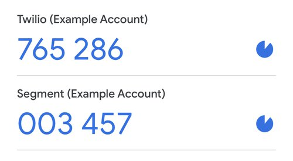
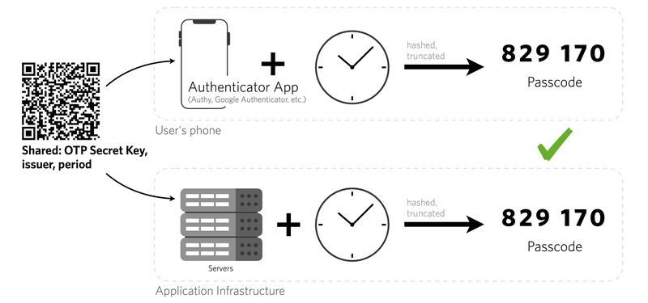
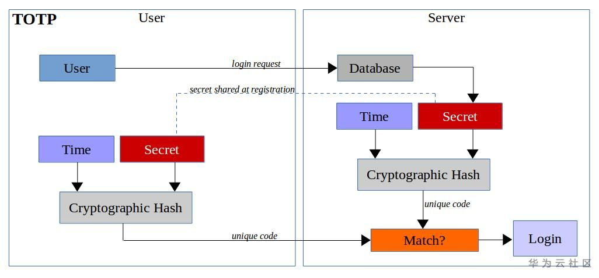

# First of all see these videos:

[Sua Segurança é uma DROGA | Gerenciadores de Senhas, 2FA, Encriptação ](https://www.youtube.com/watch?v=s7ldn31OEFc)

[How Easy It Is To Crack Your Password, With Kevin Mitnick](https://www.youtube.com/watch?v=K-96JmC2AkE) 

# Strong passwords & Password managers

### Never use the same password for different websites and apps, use one password for each
### Don't use passwords with commons words and variants.
### Use passwords as long as allowed for the registration/update password form
### Prefer to save and generate your passwords by software that generate strong passwords for all your records.

* [bitwarden](https://bitwarden.com/)
* [1password](https://1password.com/pt)
* [lastpass](https://www.lastpass.com/pt)
* [nordpass](https://nordpass.com/) $$$

### Change all your passwords right now and use one of these tools to save them

<b>These apps will generate strong passwords (try to understand how many characters is possible in the website/app form and generate passwords and save them in these apps)</b>

you just need to remember the master password for these apps, use a long phrase of at least 20 characters for these apps
for example:

"thetripthatIlikedthemostwenttochina#@!"

<b style="color:red;">Remember, the only password you can't forget is your master key, and your master key needs to be a long sentence that you preferably never forget.</b>

# 2FA (Two-factor authentication)

<b style="color:red">Use 2FA wherever possible</b>

Two-factor authentication (2FA) is an identity and access management security method that requires two forms of identification to access resources and data. 2FA gives businesses the ability to monitor and help protect their most vulnerable information and networks. some of the previous apps like bitwarden already have 2fa.

### Advantages of 2FA

- Businesses use 2FA to help protect their employees' personal and business assets. This is important because it prevents cybercriminals from stealing, destroying or accessing your internal data records for their own benefit.
 

- The advantages of 2FA are endless. For example, with 2FA, there is no need for users to upload or download a token generator, or an application associated with one. Most websites use your mobile device to text, call or use a 2FA customized for your business to verify your identity.
 

- Some other advantages of 2FA include:

• No need to use a hardware token generator. These types of 2FA methods are often lost or misplaced. However, with advanced technology, 2FA methods are more convenient than ever.

• Password generators are more efficient than traditional passwords. Generators are the most secure option as no two passwords are the same.

• Maximum password entry prevents cybercriminals from breaking in and accessing sensitive data.

• The process is manageable and easy to use.

[Google Authenticator for Android](https://play.google.com/store/apps/details?id=com.google.android.apps.authenticator2&pli=1)

[Microsoft Authenticator for Android and iOS](https://support.microsoft.com/pt-br/account-billing/baixar-e-instalar-o-microsoft-authenticator-aplicativo-351498fc-850a-45da-b7b6-27e523b8702a)

[Authy](https://authy.com/)

##### How 2FA TOTP WORKS?

TOTP stands for Time-based One-Time Passwords and is a common form of two factor authentication (2FA). Unique numeric passwords are generated with a standardized algorithm that uses the current time as an input. The time-based passwords are available offline and provide user friendly, increased account security when used as a second factor.

Example TOTP accounts in an authenticator app

 

TOTP is also known as app based authentication, software tokens, or soft tokens. Authentication apps like Authy and Google Authenticator support the TOTP standard. 

<b>The TOTP algorithm</b>

The TOTP algorithm follows an open standard documented in <a href="https://datatracker.ietf.org/doc/html/rfc6238">RFC 6238</a>. The inputs include a shared secret key and the system time. The diagram below shows how the two parties can separately calculate the passcode without internet connectivity.

<b>TOTP 2FA vs. SMS 2FA</b>

While SMS is an ideal solution for 2FA adoption and ease of use, TOTP has several benefits including: 

<b style="color:red">PS: Don't use SMS 2FA</b>

2FA TOTP has several benefits including: 

* Offline support
* PII-less registration
* Standardized authentication solution
* Software based, not dependent on carrier fees or telephony access and deliverability
* Faster average time to authenticate
* Increased security compared to SMS 2FA: the secret key input for TOTP is only shared once and the method does not rely on the telephony network, which helps reduce the attack surface. TOTP has stronger proof of possession than SMS, which can be legitimately accessed via multiple devices and may be susceptible to SIM swap attacks.

# How to save passwords in database (dev) ? bcrypt vs sha512

<b style="color:red">Use BCRYPT</b>

Storing passwords in a database securely is crucial for protecting user accounts and sensitive information. When it comes to choosing a password hashing algorithm, bcrypt and SHA-512 are two commonly discussed options. However, they serve different purposes and have different characteristics.

Bcrypt (Blowfish Crypt):
* Bcrypt is a password hashing algorithm designed specifically for securely hashing passwords. It's considered one of the best choices for this purpose due to its key features:
* Slowness: Bcrypt is deliberately slow, which makes it resistant to brute-force and dictionary attacks. The slowness factor can be adjusted with the "cost" parameter, making it adaptable to future hardware improvements.
* <b>Salt generation: Bcrypt automatically generates a random salt for each password, ensuring that identical passwords result in different hash values.</b>
* Built-in security against rainbow table attacks: Bcrypt uses the salt to defend against rainbow table attacks, where precomputed hash values for common passwords are used to quickly find matches.
* <b>Bcrypt is the preferred choice for password storage because it is specifically designed to address the security challenges of storing passwords.</b>

 SHA-512 (Secure Hash Algorithm 512-bit):

* SHA-512 is a cryptographic hash function designed for a different purpose, namely data integrity and security, rather than password hashing. It's a fast and secure hash function, but it lacks the key features necessary for secure password storage:
* Speed: SHA-512 is designed to be fast and efficient, which is not ideal for password hashing because it makes brute-force attacks more viable.
* No built-in salt generation or work factor: SHA-512 does not provide automatic salt generation, and it doesn't include a built-in mechanism for increasing the computational cost, which is crucial for password security.

<b>In summary, if you're storing passwords in a database, it is highly recommended to use bcrypt over SHA-512 or other cryptographic hash functions. Bcrypt's slowness, salt generation, and protection against rainbow table attacks make it the right choice for securely hashing passwords. Additionally, as hardware improves over time, you can increase the cost factor to maintain security against evolving threats. Always use a well-established password hashing library or implementation in your programming language to ensure best practices in password security.</b>