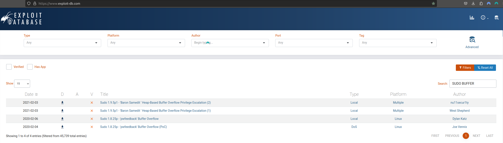
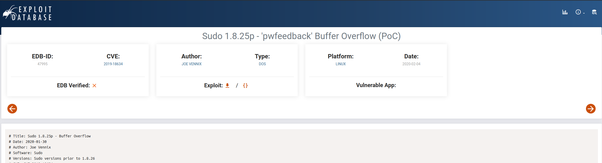

<h1 align="center">
<br>
  Red Team Operation Tools
  <br>

</h1>

<h4 align="center">A package tools for red team operations.</h4>

<p align="center">
  <a href="#guides">Guides</a> •
  <a href="#osint">OSINT</a> •
  <a href="#vulnerability-searching">Vulnerability Searching</a> •
  <a href="#bug-bounty">Bug Bounty</a> •
  <a href="#frameworks">Frameworks</a> •
  <a href="#command-injection">Command Injection</a> •
  <a href="#subdomains">Subdomains</a> •
  <a href="#webspidering">Web Spidering</a> •
  <a href="#directory-fuzzing">Directory Fuzzing</a> •
  <a href="#fingerprint">Finger print</a> •
  <a href="#vulnerability">Vulnerability</a> •
  <a href="#sensitive-data">Sensitive data</a> •
  <a href="#payloads-e-wordlists">Payloads e wordlist</a> •
  <a href="#ssl">SSL</a> •
  <a href="#misc">Misc</a> •
  <a href="#xss">XSS</a> •
  <a href="#lfi-e-rfi">LFI/RFI</a> •
  <a href="#dos">DOS</a> •
  <a href="#cloud">Cloud</a> •
  <a href="#pishing">Pishing</a> •
  <a href="#sql-injection">SQL Injection</a> •
  <a href="#communication">Communication</a> •
  <a href="#network-mapping">Network mapping</a>   •
  <a href="#social-engineer">Social Engineer</a>   •
  <a href="#steganography">Steganography</a>   •
  <a href="#others">Others</a> 
</p>

# OWASP

[OWASP API Security Top 10](https://owasp.org/API-Security/editions/2023/en/0x00-header/)

## Guides

- [Red Team Guide](https://redteam.guide/docs/templates/roe_template/)
- [Red Team Tools](https://github.com/A-poc/RedTeam-Tools)
- [Blue Team Tools](https://github.com/A-poc/BlueTeam-Tools)
- [Hack tools Chrome](https://github.com/LasCC/Hack-Tools)

## Vulnerability Searching

- [ExploitDB](https://www.exploit-db.com/)
- [NVD](https://nvd.nist.gov/vuln/search)
- [CVE Mitre](https://cve.mitre.org/)

Example search exploit from exploitdb on Kali using <b>searchsploit</b>

In this scenario i want a exploit 2020 buffer overflow in the sudo program

```bash
searchsploit "buffer overflow sudo 2020"
```

this return a list of exploits encounterd in ExploitDB with these words

if you look in exploitdb you will also find

In it you have important information, such as the <b>CVE</b>, which is the year and number of the vulnerability

In this exploit example CVE is: CVE-2019-18634

You can see more details on:
https://nvd.nist.gov/vuln/detail/CVE-2019-18634

## BUG BOUNTY

- [KingOfBugBountyTips](https://github.com/KingOfBugbounty/KingOfBugBountyTips)

## OSINT

- [OSINT Framework](https://osintframework.com/)
- [theHarvester](https://github.com/laramies/theHarvester)
- [Ifind](ifind.com/)
- [Google Hacking Database](https://www.exploit-db.com/google-hacking-database)
- [Shodan](https://www.shodan.io/dashboard?language=en)
- [WayBackMachine](https://web.archive.org/)
- [Perito Cibernetico](https://peritocibernetico.com.br/)
- [Yandex](https://yandex.com/)
- [Gmail OSINT](https://gmail-osint.activetk.jp/)
- [trape](https://github.com/jofpin/trape)
- [who.is](https://who.is/)
  
Basic Example to  SCAN website using who.is and anothers tools

```bash
sudo whois devsemfronteiras.tech
```
nslookup to get more info about dns servers from a domain

```bash
sudo nslookup devsemfronteiras.tech
```

Checks or domain in search of common subdomains using a list of internal or external words

```bash
sudo dnsmap devsemfronteiras.tech
```

host to get more info about DNS resolutions
```bash
sudo host devsemfronteiras.tech
```

tracerout trace path, hops, and delays in networks to destination.. 

```bash
sudo traceroute devsemfronteiras.tech
```
WhatWeb: Identify tech used by website (CMS, frameworks)
```bash
sudo whatweb devsemfronteiras.tech
```
or

For more informations
```bash
sudo whatweb -a 3  devsemfronteiras.tech --no-errors
```

Using dirb for web directory brute-forcing tool to find hidden files/folders.

```bash
sudo dirb http://devsemfronteiras.tech -f
```

Using the harvester to extract emails, domains, info from public sources for reconnaissance.

```bash
sudo theHarvester -d devsemfronteiras.tech -b all
```

Nmap for discovering hosts, services, vulnerabilities.

```bash
sudo nmap -v -A devsemfronteiras.tech
```


## Frameworks

- [Jok3r](https://github.com/koutto/jok3r)
  - Directory report: /var/lib/docker/overlay2/7564110b79006ce12e17a7036ed8cf837cbace06b8b02c6fa450c273bf25bbe7/diff/root/jok3r/reports
- [Sn1per](https://github.com/1N3/Sn1per)
  - Directory report:/usr/share/sniper/loot/workspace/https:--loja.obahortifruti.com.br/osint/intodns-loja.obahortifruti.com.br.html
- [Mythic](https://github.com/its-a-feature/Mythic.git)

## COMMAND INJECTION

- [Commix](https://github.com/commixproject/commix.git)

## SUBDOMAINS
- [maltego](https://www.maltego.com/)
- [recon-ng](https://github.com/lanmaster53/recon-ng)
- [knock](https://github.com/guelfoweb/knock)
- [lazyrecon](https://github.com/nahamsec/lazyrecon)
- [subfinder](https://github.com/projectdiscovery/subfinder)
- [assetfinder](https://github.com/tomnomnom/assetfinder)
- [Amass](https://github.com/OWASP/Amass)
- [subliest3r](https://github.com/aboul3la/Sublist3r)

## WEBSPIDERING

- [gospider](https://github.com/jaeles-project/gospider)
- [gau](https://github.com/lc/gau)
- [LinkFinder](https://github.com/GerbenJavado/LinkFinder)
- [waybackurls](https://github.com/tomnomnom/waybackurls)
- [hakrawler](https://github.com/hakluke/hakrawler)
- [ParamSpider](https://github.com/devanshbatham/ParamSpider)

## Directory Fuzzing

- [ffuf](https://github.com/ffuf/ffuf)
- [wfuzz](https://github.com/xmendez/wfuzz)
- [gobuster](https://github.com/OJ/gobuster)
- [DirBuster](https://github.com/KajanM/DirBuster)
- [dirb](https://github.com/v0re/dirb)
- [turbo search](https://github.com/helviojunior/turbosearch)

## FINGERPRINT

- [wappalyzer](https://chrome.google.com/webstore/detail/wappalyzer-technology-pro/gppongmhjkpfnbhagpmjfkannfbllamg?hl=pt-BR)
- [builtwith](https://chrome.google.com/webstore/detail/builtwith-technology-prof/dapjbgnjinbpoindlpdmhochffioedbn?hl=pt)
- [whatweb](https://github.com/urbanadventurer/WhatWeb)

## VULNERABILITY

- [nuclei](https://github.com/projectdiscovery/nuclei)
- [wpscan](https://github.com/wpscanteam/wpscan)
- [nikto](https://github.com/sullo/nikto)
- [owaspzap](https://www.zaproxy.org/)
- [joomscan](https://github.com/OWASP/joomscan)
- [faraday](https://github.com/infobyte/faraday)
- [nessus](https://www.tenable.com/products/nessus) 
- [openvas](https://github.com/greenbone/openvas-scanner) 
- [ncat](https://nmap.org/ncat/guide/index.html) 

## SENSITIVE DATA

- [intelx](https://intelx.io/)
- [leakcheck](https://leakcheck.net/)
- [snusbase](https://snusbase.com/)
- [breachchecker](https://breachchecker.com/)
- [leak lookup](https://leak-lookup.com/)
- [we leak info](https://weleakinfo.to/)
- [leak check](https://leakcheck.io/)
- [scatteredsecrets](https://lnkd.in/d5X_jCp8)
- [ghostproject](https://ghostproject.fr/)

## PAYLOADS E WORDLISTS

- [PayloadsAllTheThings](https://github.com/swisskyrepo/PayloadsAllTheThings)
- [seclists wordlists](https://github.com/danielmiessler/SecLists)
- [leaky-paths](https://github.com/ayoubfathi/leaky-paths)

## SSL

- [sslscan](https://github.com/rbsec/sslscan)
- [sslhopper](https://www.sslshopper.com/)

## MISC

- [httpx](https://github.com/projectdiscovery/httpx)
- [metasploit](https://github.com/rapid7/metasploit-framework)
- [dnsdumpster](https://github.com/nmmapper/dnsdumpster)
- [httprobe](https://github.com/tomnomnom/httprobe)
- [recon-ng](https://github.com/lanmaster53/recon-ng)
- [securitytrails](https://github.com/secops4thewin/securitytrails-python/blob/master/securitytrails.py)

## XSS

- [xss-Strike](https://github.com/s0md3v/XSStrike)
- [ppmap](https://github.com/kleiton0x00/ppmap.git)

## LFI E RFI

- [kadimus](https://github.com/P0cL4bs/kadimus)
  - requiriment: apt install libcurl4-nss-dev libpcre3-dev libssh-dev
    ./kadimus -u https://www.cocamar.com.br/busca?s= -T data --parameter -c "id"

## DOS

- [slowhttptest](https://github.com/shekyan/slowhttptest.git)
  - slowhttptest -c 500 -H -g -o ./result -i 10 -r 200 -t GET -u https://sunweb.cocamar.com.br/ -x 24 -p 2

## CLOUD

- [Cloud Brute](https://github.com/0xsha/CloudBrute)
- [Awesome Azure Pentest](https://github.com/Kyuu-Ji/Awesome-Azure-Pentest)

## PISHING

- [gophish](https://github.com/gophish/gophish)
- [zphisher](https://github.com/htr-tech/zphisher)
- [SocialFish](https://github.com/UndeadSec/SocialFish)

## SQL INJECTION

- [sqlmap](https://github.com/sqlmapproject/sqlmap)

## COMUNICATTION

- [vectro.io](http://vectr.io/)
- [slack](https://slack.com/intl/pt-br/)
  
## NETWORK MAPPING

- [nmap](https://github.com/nmap/nmap)

## SOCIAL ENGINEER 

- [The Social-Engineer Toolkit (SET)](https://github.com/trustedsec/social-engineer-toolkit)

## STEGANOGRAPHY

- [zsteg](https://github.com/zed-0xff/zsteg)
- [Aperi'Solve](https://www.aperisolve.fr/)
- [StegOnline](https://stegonline.georgeom.net/)


## OTHERS

- [haveibeenpwned](https://haveibeenpwned.com/)
- [CMD Commands for hacking](https://cmdwindows.com/cmd-commands-for-hacking)
- [Hackmageddon](https://www.hackmageddon.com/)

## Credits and references

- https://tryhackme.com/
- Gdorks Dracul
- All repositories and contributors on this docs.
